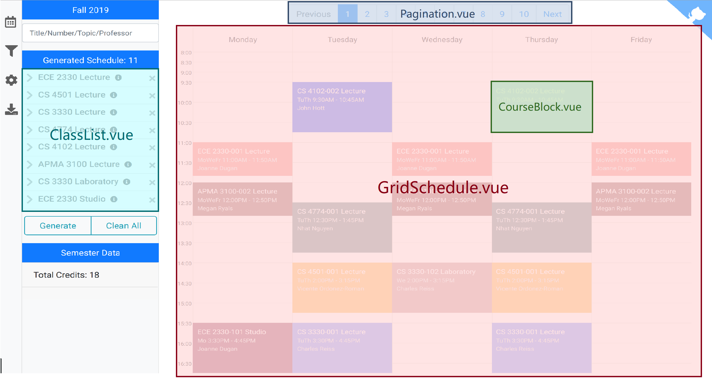

# Documentation

This folder contains the documentation of the project. It is currently working in progress.

Our website is a single-page application (SPA). Our source code is intended to be modular. We have a number of directories and files that play separate roles.

-   [App.vue](/src/App.vue): the root component
-   [components](/src/components): all Vue components
-   [algorithm](/src/algorithm): algorithm for schedule building and rendering
-   [models](/src/models): models and data structures used to store and manipulate data
-   [store](/src/store): the state management module
-   [data](/src/data): data loaders
-   [utils](/src/utils): utilities used across the whole project

<!--  -->

## TypeDoc

TypeDoc is a JSDoc-like documentation built from source code. Our TypeDoc that is built from master is available to browse at https://plannable.org/docs/tsdoc/. However, I personally prefer checking out the source code in my favorite editor rather than browsing the built doc online

### Building from source

You can build the documentation for typescript files by running

```bash
npm run tsdoc
```

It will be available in docs/tsdoc when the above command finish.

## Architecture Diagram

The following diagram gives an overview of our website's architecture.


## Why TypeScript

TypeScript helps us to maintain this large and complex website by providing static type information and type checking. It helps to eliminate errors at compile time rather then at run time. With TypeScript, a change in a data structure's API will cause the compiler to throw errors everywhere when it is used, which aids refactoring.

Because the aforementioned benefits (and many others), we strive to make everything in our codebase type-safe.

## View Layer

The view layer mainly consists of Vue components and the state management modules. We separate the TypeScript part from each Vue component and use a file of the same name to store them. The justification for this separation is that the TypeScript language service can know which modules are used by these components. For example, if we use "Find All References" of a class exported by one of our model files, we are able to the usage of this class in all components. This is particularly useful if we want to change some of our models' APIs.

Some components are pure and some are not. Pure components refer to those whose states only depend on the props passed into them. Non-pure components, on the other hand, depend on the global Store module, which means they usually `extends Store`.

## State Management

A common state management library used in Vue projects is Vuex. However, because it is simply too verbose to write type-safe Vuex code, we decided to not use it. Instead, we composed the store modules by ourselves and form a Mixin that is injected in places where it is needed.

Our Store class (see [src/store/store.ts](/src/store/store.ts)) is declared as a Vue component so Vue can observe its data. In this class, `filter`, `display`, etc. are references to the **instances** of the sub-module classes. The Store class keeps a list of **references** to the sub-module instances so that when they are mixed into other components, they refer to the same instance. Any mutation of the properties contained in these shared instances can be observed by Vue and trigger re-render in whatever places they are used.

The watchers that watch properties whose change should dispatch events are defined in [src/store/watch.ts](/src/store/watch.ts). They are declared outside of the Store class because they should be only registered once.

```typescript
@Component
class Store extends Vue {
    filter = filter;
    display = display;
    status = status;
    modal = modal;
    schedule = schedule;
    semester = semester;
    palette = palette;
    noti = noti;

    ...
}
```

### Global Variables

We use a number of global variables to share large and non-reactive data, because for those large objects, the reactive observers may slow down execution significantly. More specifically, we have the following variables declared and assigned on the `window` object.

-   catalog
-   scheduleEvaluator
-   timeMatrix
-   buildingList

The `catalog` variable is an instance of the `Catalog` class and is used to store the course data of the current semester. `scheduleEvaluator` is an instance of the `ScheduleEvaluator` class that is used to store the generated schedules. Both instances have instance properties that contain more than a thousand keys/values. The other two variables store the data needed by the `Walking Distance` sort option.

## Model and Algorithm

Although used everywhere, the model and algorithm layer is meant to be separated from the view layer. The view layer uses models and algorithms by instantiating objects defined by model/algorithm and pass any required parameters into the constructors/methods/functions of the models or algorithms used. It is not recommended to import components/store classes directly into the model/algorithm layer, because circular dependency issues may arise.

For example, if the `schedule` store class imports the `Schedule` model and instantiates `Schedule` instances inside the module, and the `Schedule` imports a `schedule` store instance and use it inside the `Schedule` class, then there is going to be a big issue, e.g. the `Schedule` class is undefined!

## Optimizations

We made a lot of efforts to optimize our code so our website runs fast. However, it must be noted that we DO NOT optimize prematurely! We only optimize those that need to run really fast. There is little need to optimize a function that completes within a matter of milliseconds and is only called once per lifetime.
Examples of things that need to run fast include, but not limited to,

-   ScheduleGenerator.ts, as the number of possible schedules is exponential in the number of courses chosen
-   ScheduleEvaluator.ts, as it is evaluating all the schedules given by the ScheduleGenerator
-   Coloring.ts, as graph coloring is an NP-complete problem, implying that the best-known exact algorithms run in exponential time.

Examples of things that do not need to run that fast include, but not limited to,

-   computeSchedule method in Schedule.ts, as it runs on small inputs and produces small outputs. There exists slow functional code and deeply nested for loops, but (excluding the Coloring part) it completes within 5ms!
-   most of the methods provided by Course.ts and Section.ts, as they are not invoked very frequently, i.e. not thousand times in a row.

## Do you know?

-   **Nested** ternary operators (`? : ? :`) are usually written by Kaiying Shan
-   **Chained** functional statements (`.map(...).filter(...)`) are usually written by Hanzhi Zhou
-   **Strange variable names** usually credit to Zichao Hu, whose GitHub username (OAHC2022) is peculiar
