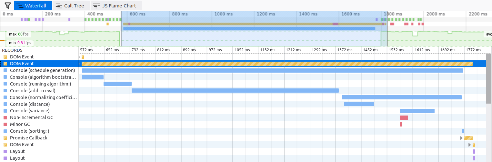

# Algorithm and Data Structure

This page discusses the data structures and optimizations involved in schedule generation and evaluation

## Introduction

A schedule is nothing more than an array of sections, one from each course. The number of possible schedules in total is the product of the number of sections in each course. With this many possibilities, it is important to optimize the ScheduleGenerator and ScheduleEvaluator so we can efficiently generate and sort these schedules. The figure below shows the time waterfall when generating 1 million schedules out of a 15 credit schedule.



## Schedule Generation

### Algorithm Bootstrap

Before generating schedules, we first need to gather the candidate sections for each course. Because courses have different number of sections, the data structure for storing these sections is an array of arrays. The sections occurring at the same time are combined to reduce the total number of sections.

Each combined section is a tuple of the course key and the array of section ids that occur at the same time.

```ts
type RawAlgoCourse = [string, number[]];
const classList: RawAlgoCourse[][] = [
    [
        ['cs11105', [11156]],
        ['cs11105', [12333]],
        ['cs11105', [10583]]
    ], // course 1
    [
        ['enwr15105', [11346, 12525]],
        ['enwr15105', [23512, 11001]]
    ], // course 2
    [...], // course 3
];
/**
 * example: sec1 is the second section of the second course
 */
const sec1 = classList[1][1]; // ['enwr15105', [23512, 11001]]
```

Then, we need to gather the meeting time for these sections, as we will make sure that none of the sections in a schedule conflict with each other. Therefore, we create a variable called `timeArrList` that has one-to-one correspondence with the combined sections stored in the `classList`. The time representation of each section is discussed below.

### Time and Room Representation

The meeting time of a section is given by the day and the time period when people meet. Because a week only has 7 days, prior to v7, we represent a week using a tuple of 7 arrays. In each array, we represent the start and end of a meeting as the number of minutes starting from 0:00, so 10:00 to 11:00 become `[600, 660]`. The room is converted to a number, which is an index in the array of all buildings. If there is no meeting at a given day, it is left empty. If there is more than 1 meeting per day, the start, end and room number of them are concatenated together.

Using this method, the representation of a section that meets at Monday, Wednesday, Friday 10:00 to 10:00 at room 12 and Monday 20:00 to 21:00 at room 43 is shown below.


_Time and Room Representation Prior to v7.0_

However, these is a lot of overhead in storing these small arrays, as the JS engine has to track a lot of meta data, e.g. element kinds, hidden class, length, etc. This memory overhead becomes especially important in ScheduleEvaluator, which we will see later. Also, it is common for one or more of these arrays to be empty, especially at index 6 and 7. A natural idea of optimization is to concatenate all of them together. Then, the problem is to figure out the line of separation for each day. Luckily, with the observation that the number of days in a week, 7, is always fixed, we came up with a solution.


_Time and Room Representation After v7.0_

We concatenate all these small arrays together, and we keep track of the start and end indices of each day using the first 8 values<sup>note 1</sup>. Monday is stored at range `arr[0]` to `arr[1]` exclusive, Tuesday is stored at range `arr[1]` to `arr[2]`, etc. If `arr[i]` is the same as `arr[i+1]`, that means day `i` is empty. Because each day only has 1440 minutes and probably no college has more than 32767 available buildings, we can store the entire array in int16, using `Int16Array`, which saves even more memory. Note that we use signed int16 because unknown buildings are represented as -1.

The code example that loops through each of the meeting is shown below.

```js
for (let i = 0; i < 7; i++) {
    const dayEnd = timeArr[i + 1];
    for (let j = timeArr[i]; j < dayEnd; j += 3) {
        const timeStart = timeArr[j],
            timeEnd = timeArr[j + 1],
            roomIdx = timeArr[j + 2];
        // do some processing
    }
}
```

### Time Conflict Cache

When developing version 7.0, we discovered that it is much more efficient to pre-compute the conflict between all pairs of sections in different courses than computing them on-the-fly. The reasons are outlined below.

#### Pre-computation

Assume there are `n` courses, and the maximum number of sections in each course is `m`. Then, when pre-computing the conflicts, the upper bound of pairs we need to considered is roughly `(n * m)^2 / 2`.

#### On-the-fly

We build each schedule incrementally. When we try a new section, the first thing we need to check is whether it conflicts with the sections already in the schedule, achieved by iterating through them and checking the newly chosen section with each of them. Thus, for each schedule, we need to check 1 + 2 + ... + n - 1 number of conflicts, which is `n (n - 1) / 2`. The upper bound for the number of schedules is `m^n`. Therefore, the on-the-fly method requires an upper bound of `(m ^ n) * n (n - 1) / 2` number of conflict calculations, which is usually much more than the number obtained in the previous section.

#### The Cache Tensor

The conflict cache is a 4d boolean tensor, stored as an `Uint8Array`.

```js
const conflictCache = new Uint8Array(buffer, byteOffset, sideLen ** 2);
```

The conflict between section1 of course1 and section2 of course2 is obtained by

```js
conflictCache[(section1 * numCourses + course1) * sideLen + (section2 * numCourses + course2)];
// like this: conflictCache[section1][course1][section2][course2]
```

where `sideLen = numCourses * maxNumOfSectionsInEachCourse`

Although in theory we can do bit-packing to further reduce the memory footprint of the conflict cache, it degrades the performance due to the usage of bitwise operations and integer division/modulo.

#### Schedule Representation

Prior to v7.0, we store each schedule as an array of `RawAlgoCourse`, and we later store all the schedules generated in an array in `ScheduleEvaluator`.

```ts
const schedules: RawAlgoCourse[][] = [
    [['cs11105', [11156]], ...], // schedule 1
    [['cs11105', [14574]], ...] // schedule 2
    [...],
    ...
]
```

However, there is a lot of memory overhead in storing these small, non-primitive arrays. With the observation that the length of a schedule is the same as the number of courses (we always choose one section for each course), in version 7.0, we store each schedule as an array of **choice number** for each section. Therefore, `[1, 2, 0]` means that we choose the second section from the first course, third section from the second course, and the first section from the third course.

```ts
const allChoices =
[   // Schedule 1    Schedule 2
    1, 2, 0, ...,    1, 2, 1, ...
];
```

Additionally, since all schedules are of the same length, we can avoid storing nested arrays by simply concatenating the schedules together. The schedule `i` will be in between `i * numCourse` and `(i+1)*numCourse`.

To convert the schedule `i` to the format prior to v7, we can use

```ts
Array.from(allChoices.slice(idx, idx + numCourses)).map(
    (choice, classNum) => classList[classNum][choice]
);
```

### Main Loop

The main loop is where we build schedules.

#### Path Memory

Under Construction

#### Current Choices

Under Construction

#### Time Len Computation

Under Construction

## Schedule Evaluation and Sorting

The goal of the schedule evaluator is to efficiently sort the generated schedules
according to the set of the rules defined by the user. As shown in the water fall diagram at the top of the page, schedule evaluation is the performance bottleneck. The following sections outline the data structures we used and how we optimize for speed.

### Pre-computing Coefficients

To sort schedules, we first need to compute a numeric coefficient for each one of them and call `Array.sort`. A typical sort implementation requires `n log n` comparisons, so if we compute that coefficient on-the-fly, we would need `n log n` calculations. Nevertheless, computing such a coefficient is very computationally expensive, so it is better to compute then upfront and cache them in an array, which requires only `n` computations.

#### Sorting Time Blocks

The computation of coefficient for each schedule is not very straightforward, because most of the sort options rely on the spacial and temporal correlation between pairs of meetings. More specifically, `compactness` and `distance` require calculation if time/distance between consecutive pairs of meetings, and `noEarly` requires us to know which meeting is the earliest one. Therefore, it is necessary to sort the meetings in each day by their start time.

This part is currently implemented in the constructor of the ScheduleEvaluator

#### Coefficient Cache

Because it is costly to compute the coefficient for each schedule with each sort option, we created cache array for each of the already-computed option. This is the key to the high-responsiveness of interactive sorting.

For example, if the sort option `distance` is enabled, then the `distance` coefficient for each schedule is computed upon generation, stored in an object called `sortCoeffCache` as Float32Array, with `distance` as its key. If the user alters other sort options or flip the sort direction, we can just use the cached Float32Array to do the rest of the computation, without recomputing the distance coefficient for each schedule.

#### Coefficient Normalization

> Note: This part is not applicable to the fallback sort mode.

For the `combined` sort mode, we need to combine the sort options selected by the user. An naive approach is to do element-wise addition on the coefficient arrays produced by each sort option. However, the problem is that different sort options produce values of different order of magnitudes. For example, the `variance` option usually produces values that is several order of magnitudes greater than that produced by the `compactness` option.

To address this issue, we _normalize_ the coefficients produced by each sort option to range `0 - 100`, which is done by subtracting the `min`, dividing `max - min` and multiplying by 100 for each value. Then, the coefficients produced by each sort option are combined using Euclidean distance, but without the square root.

```ts
combined[i] = coeffs1[i] ** 2 + coeffs2[i] ** 2 + coeffs3[i] ** 2;
```

### Sort

Depending on the user configuration and the number of schedules generated, we will employ one of the following methods to sort our schedules.

#### Fisher–Yates Shuffle Algorithm

This shuffle algorithm will only be applied if the user enabled the `I am Feeling Lucky` (AKA Random sort) option. There is no cache for this option, nor will a _real_ sort occurs, since shuffle takes linear time while sorting takes linear-logarithmic time.

#### Floyd–Rivest Selection (Quickselect)

When there are many schedules generated, sorting may take a considerable amount of time due to its `n log n` complexity. Therefore, it is necessary to employ some techniques to optimize for performance. With the observation that the user will usually examine the first few batches of schedules, it is unnecessary to sort all of them in order. In fact, we only need to pick, say, the best 100 schedules and place them in front.

After some research, we used an implementation of the Floyd–Rivest selection algorithm, which can select the k max/min elements from the array, consuming only linear time. When there are more than 10 thousand schedules generated, we use it to select the 1000 best schedules and then sort them in order. Sorting these 1000 schedules only adds a tiny overhead.

#### Complete Sorting

As mentioned in the previous section, complete sorting will only be used when there are less than 10000 schedules.
